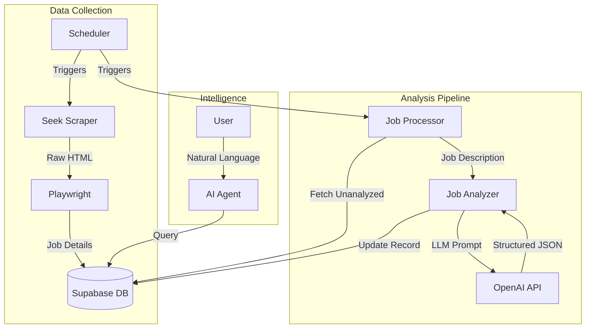

# AUJobsSearcher

## Project Overview
AUJobsSearcher is a specialized job market analysis tool designed to track and analyze technology job trends in Australia. It scrapes job listings from major platforms (starting with Seek), stores them in a structured database, and uses Large Language Models (LLMs) to extract detailed insights such as required skills, tools, and seniority levels.

## Architecture



## Components

### 1. Scrapers (`backend/scrapers/`)
- **SeekScraper**: Built with `Playwright` and `BeautifulSoup`.
    - Navigates Seek.com.au search results.
    - Handles pagination and deduplication (checks existing URLs).
    - Extracts key details: Title, Company, Location, Salary, Description.
    - Saves initial raw data to Supabase.

### 2. Job Analyzer (`backend/analyzers/`)
- **JobAnalyzer**: Powered by `LangChain` and `OpenAI`.
    - Takes raw job descriptions.
    - Uses a structured prompt to extract:
        - **Technical Skills**: Python, AWS, React, etc.
        - **Soft Skills**: Communication, Leadership.
        - **Tools**: Jira, Docker, Kubernetes.
        - **Employer Focus**: Values, Domain Knowledge.
    - Returns data in a strict JSON format.

### 3. Database (`backend/db/`)
- **Supabase (PostgreSQL)**:
    - Stores job postings in the `job_postings` table.
    - Handles deduplication using a "fingerprint" (Company + Title).
    - Supports vector embeddings (future proofing for semantic search).

### 4. Scheduler (`backend/scripts/scheduler.py`)
- Runs daily at 06:00.
- Orchestrates the workflow:
    1. Runs `SeekScraper` to fetch new jobs.
    2. Runs `JobProcessor` to analyze any jobs missing LLM data.

### 5. AI Agent (`backend/agent/`)
- **DeepAgent**: A custom agentic interface.
- Capable of querying the database using natural language.
- Can answer questions like "What are the top skills required for Python developers in Sydney?".

## Setup

### Prerequisites
- Python 3.10+
- Supabase Account
- OpenAI API Key

### Environment Variables
Create a `.env` file in `backend/`:
```env
SUPABASE_URL=your_supabase_url
SUPABASE_KEY=your_supabase_service_role_key
OPENAI_API_KEY=your_openai_api_key
```

### Installation
```bash
cd backend
pip install -r requirements.txt
playwright install chromium
```

## Usage

### Run Scraper Manually
```bash
python -m backend.scrapers.seek_scraper
```

### Run Analysis Manually
```bash
python -m backend.scripts.job_processor
```

### Start Scheduler
```bash
python -m backend.scripts.scheduler
```
